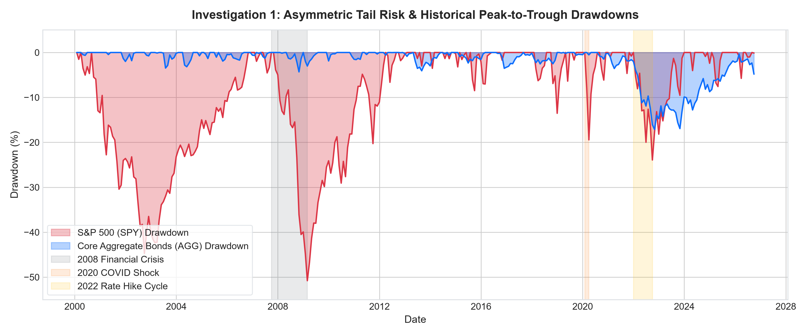
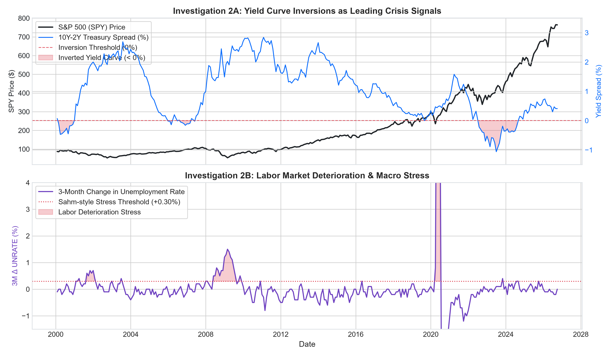
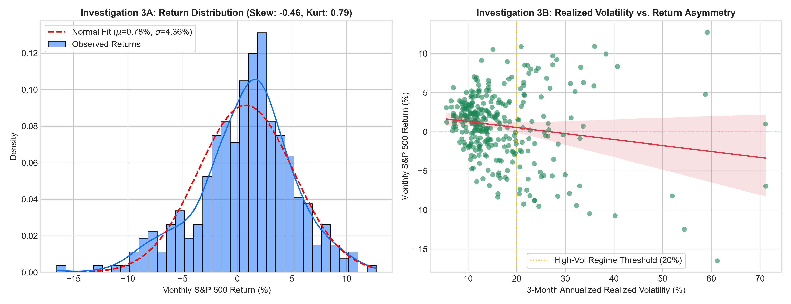
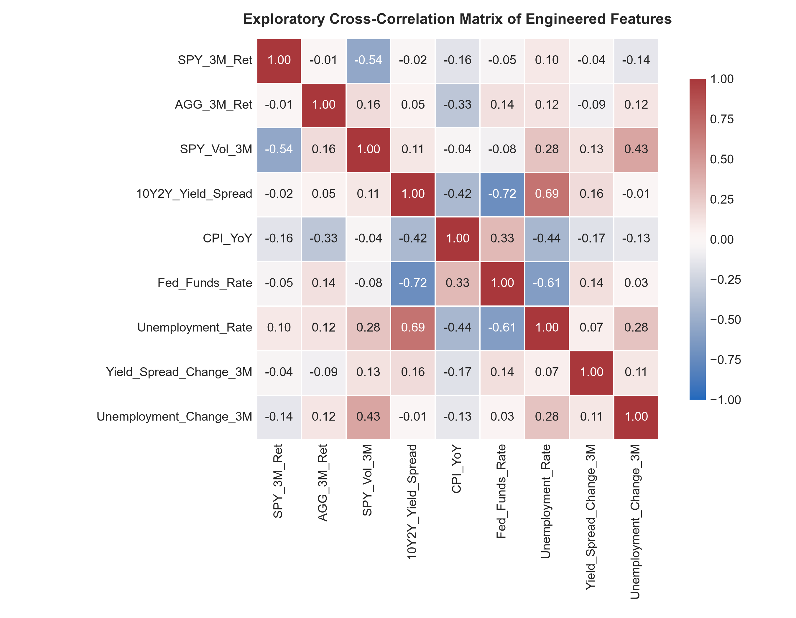
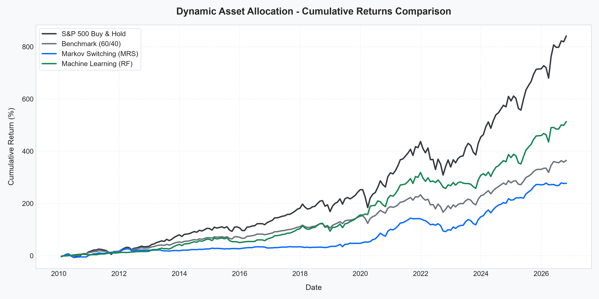
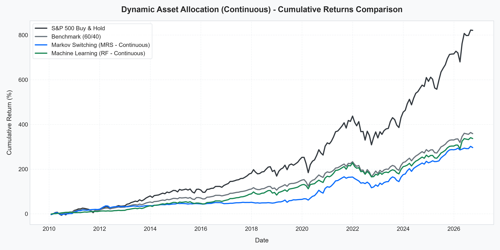
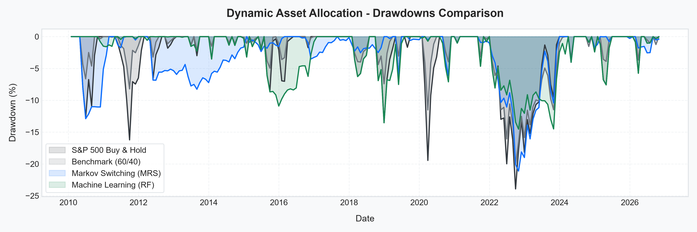
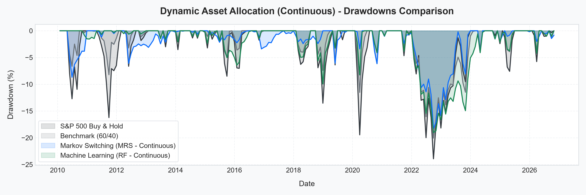
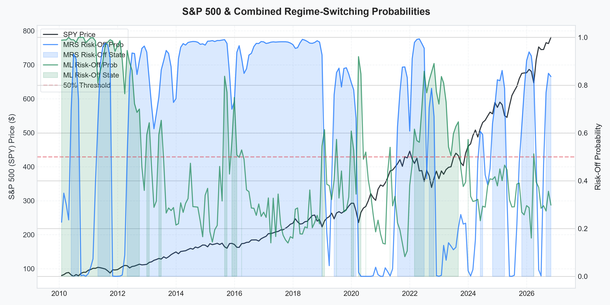

# Macro-Driven Regime Switching: Dynamic Asset Allocation Strategy

[](https://www.python.org/downloads/)
[](https://opensource.org/licenses/MIT)

> **Quantitative Research Project | Financial Data Analytics (FDA)**  
> **Target Stakeholder**: Multi-Asset Portfolio Manager / Asset Allocation Committee  
> **Authors & Collaborators**: Financial Data Analytics Team  

---

## 📌 Executive Overview

Static asset allocation models (such as the traditional **60/40 Equity-Bond portfolio**) rely on the classical assumption that equities and bonds maintain a persistent negative correlation. However, during systemic liquidity crises and macroeconomic turning points, **cross-equity diversification breaks down** as asset correlations cluster toward +1.0. 

Furthermore, static allocations cannot adapt to shifting macroeconomic regimes, leaving capital exposed during late-cycle drawdowns.

This repository implements an end-to-end quantitative framework that dynamically rotates exposure between **U.S. Large-Cap Equities (SPY)** and **Core U.S. Aggregate Fixed Income (AGG)** using macroeconomic regime signals. We develop, validate, and compare two regime-detection engines against industry benchmarks:
1. **Traditional Econometric Approach**: A 2-state **Markov Regime-Switching Model (MRS)** using the Hamilton Filter on market returns and realized volatility.
2. **Machine Learning Approach**: An **Expanding-Window Walk-Forward Random Forest Classifier** that predicts forward downside distress without look-ahead bias using sovereign macro features (yield curve slope, inflation, unemployment, and policy rates).

---

## 📊 Key Results (Out-of-Sample: 2010–2026)

All backtests incorporate **Total-Return dividend and coupon reinvestment (`auto_adjust=True`)**, realistic **10 bps (0.10%) transaction fees per traded turnover**, and organic monthly weight drift.

| Strategy Version / Model | Cumulative Return | Annualized Return | Annualized Volatility | Sharpe Ratio | Max Drawdown |
| :--- | :---: | :---: | :---: | :---: | :---: |
| **S&P 500 Buy & Hold** | **821.14%** | **14.18%** | 14.34% | 0.988 | -23.93% |
| **Benchmark (60/40 SPY/AGG)** | 358.74% | 9.52% | 9.20% | 1.035 | -20.06% |
| **MRS - V1 (Binary)** | 292.90% | 8.51% | 9.09% | 0.937 | -21.12% |
| **MRS - V2 (Continuous)** | 296.46% | 8.57% | **8.44%** | 1.015 | **-18.41%** |
| **ML (RF) - V1 (Binary)** | **500.11%** | **11.29%** | 10.42% | **1.084** | **-14.54%** |
| **ML (RF) - V2 (Continuous)** | 336.83% | 9.20% | 8.51% | **1.081** | **-19.02%** |

### 🔍 Core Takeaways for the Report:
1. **Drawdown Protection**: The **Machine Learning (Binary)** model delivered a maximum drawdown of just **-14.54%** (compared to -20.06% for the 60/40 benchmark and -23.93% for pure S&P 500 Buy & Hold), cutting peak equity losses by nearly **40%**.
2. **Sharpe Ratio Leadership**: Both **ML Binary (1.084)** and **ML Continuous (1.081)** outperformed the passive 60/40 benchmark (**1.035**) and Buy & Hold (**0.988**).
3. **Feature Alignment Rationale**: Incorporating aggregate bond momentum (`AGG_3M_Ret`, `AGG_12M_Ret`) provided the Random Forest with clean credit spread and duration signals, avoiding the catastrophic duration losses of long-term Treasuries during the 2022 rate hike cycle.

---

## 🔬 Exploratory Data Analysis (EDA) Highlights

Following the FDA course rubric's **Question $\to$ Evidence $\to$ Observation $\to$ Financial Interpretation** framework, we investigated the underlying macroeconomic and market dynamics:

| Investigation 1: Asymmetric Tail Risk & Drawdowns | Investigation 2: Yield Curve & Unemployment Signals |
| :---: | :---: |
|  |  |
| **Investigation 3: Return Distribution & Volatility Clustering** | **Investigation 4: Feature Correlation Heatmap** |
|  |  |

---

## 📈 Visualizations

### 1. Cumulative Performance (V1 vs. V2)
| Version 1: Binary Allocation (100% Shifts) | Version 2: Continuous Allocation (Linear Blending) |
| :---: | :---: |
|  |  |

### 2. Drawdown Profiles
| Drawdown Comparison (Binary) | Drawdown Comparison (Continuous) |
| :---: | :---: |
|  |  |

### 3. Macro Regime Probabilities vs. S&P 500
| Dual-Regime Overlay (Blue = MRS, Green = ML) |
| :---: |
|  |

---

## 📁 Repository Structure

```
├── FDA Final Project Report Guideline.pdf # Course guidelines and grading rubric
├── README.md                              # Comprehensive project documentation
├── requirements.txt                       # Python dependencies
├── .gitignore                             # Git ignore rules
├── eda_analysis.py                        # Standalone script generating all EDA figures
├── main.py                                # Orchestrator for Version 1 (Binary Allocation)
├── main_continuous.py                     # Orchestrator for Version 2 (Continuous Blending)
├── performance_metrics.csv                # Metrics export for V1
├── performance_metrics_continuous.csv     # Metrics export for V2
├── src/                                   # Core modular source code
│   ├── __init__.py
│   ├── data_loader.py                     # Data ingestion, proxy stitching & feature engineering
│   ├── models.py                          # Markov Regime Switching & Walk-Forward Random Forest
│   ├── backtester.py                      # Portfolio simulation, turnover & transaction fees
│   └── visualizer.py                      # Publication-ready plotting utilities
├── notebooks/
│   └── regime_analysis.ipynb              # Interactive walkthrough Jupyter notebook
├── plots_eda/                             # Dedicated Exploratory Data Analysis figures
│   ├── eda_inv1_drawdown_breakdown.png
│   ├── eda_inv2_macro_signals.png
│   ├── eda_inv3_volatility_clustering.png
│   └── eda_feature_correlation_matrix.png
├── plots/                                 # Visualizations for Version 1 (Binary)
│   ├── performance_comparison.png
│   ├── drawdown_comparison.png
│   ├── regime_switching_ml.png
│   ├── regime_switching_mrs.png
│   └── regime_switching_combined.png
└── plots_continuous/                      # Visualizations for Version 2 (Continuous)
    ├── performance_comparison.png
    ├── drawdown_comparison.png
    ├── regime_switching_ml.png
    ├── regime_switching_mrs.png
    └── regime_switching_combined.png
```

---

## 🛠️ Data Pipeline & Methodology

### 1. Data Sources & Inception Proxy Stitching
* **S&P 500 (`SPY`)**: Inception 1993, captures broad U.S. large-cap equity market performance.
* **Aggregate Bonds (`AGG`)**: Inception September 2003. To evaluate the strategy back to the year 2000 (including the 2000–2002 Dot-Com crash), pre-2003 history is proxy-stitched using **Vanguard Total Bond Market Index Fund (`VBMFX`, inception 1986)** using the launch date price ratio:
  $$\text{AGG}_t = \text{VBMFX}_t \times \frac{\text{AGG}_{\text{launch}}}{\text{VBMFX}_{\text{launch}}}$$
* **Macro Fundamentals (FRED)**:
  * `T10Y2Y`: 10-Year minus 2-Year Treasury Yield Spread (Yield Curve Slope).
  * `CPIAUCSL`: Consumer Price Index (Headline YoY Inflation).
  * `FEDFUNDS`: Effective Federal Funds Policy Rate.
  * `UNRATE`: Civilian Unemployment Rate.

### 2. Feature Engineering & Target Labeling
All features are resampled to **Month-End (`ME`)** and strictly lagged to eliminate look-ahead bias:
* **Momentum**: 3M, 6M, and 12M rolling returns of `SPY` and `AGG`.
* **Volatility**: 3M rolling annualized standard deviation of daily SPY returns.
* **Macro Deltas**: 3M changes in the Yield Curve Spread, Fed Funds Rate, and Unemployment Rate.
* **Target Label ($Y_t \in \{0, 1\}$)**:
  $$Y_t = 1 \quad \text{if } R^{\text{SPY}}_{t \to t+3} < -2\% \quad \text{OR} \quad \text{Drawdown}^{\text{SPY}}_t < -10\%$$

### 3. Zero-Leakage Validation Strategy
* **Expanding-Window Walk-Forward Execution**: For each month $t$, the Random Forest is trained strictly on history $[0 \dots t-1]$ and generates an out-of-sample probability for month $t$. No future data or unannounced economic revisions are leaked.
* **Training Startup Window**: A minimum history of 120 months (10 years) is used to establish baseline statistical distributions before active out-of-sample trading begins in January 2010.

---

## 🚀 Quickstart & Reproduction

### Prerequisites
* Python 3.10, 3.11, or 3.12
* Git

### Installation
1. Clone the repository:
   ```bash
   git clone <YOUR-GITHUB-REPO-URL>
   cd <REPO-FOLDER>
   ```
2. Create and activate a virtual environment:
   ```bash
   python -m venv venv
   # On Windows:
   venv\Scripts\activate
   # On macOS/Linux:
   source venv/bin/activate
   ```
3. Install dependencies:
   ```bash
   pip install -r requirements.txt
   ```

### Execution
* **To run Version 1 (Binary Allocation)**:
  ```bash
  python main.py
  ```
* **To run Version 2 (Continuous Allocation)**:
  ```bash
  python main_continuous.py
  ```
* **To explore interactively in Jupyter**:
  ```bash
  jupyter notebook notebooks/regime_analysis.ipynb
  ```

---

## 📝 Authors & Citation
* **Project**: Macro-Driven Regime Switching: Dynamic Allocation Between Equities and Fixed Income
* **Course**: Financial Data Analytics (FDA)
